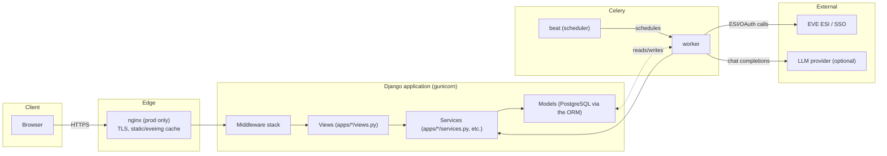
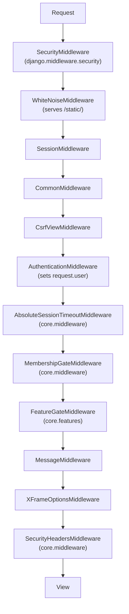
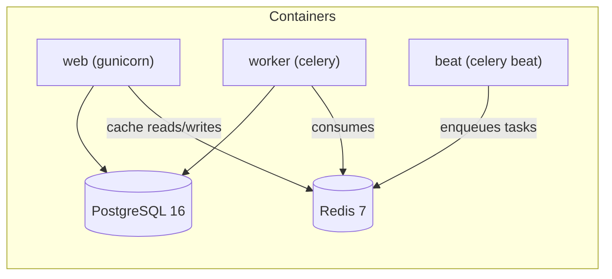

# Architecture

## Table of contents

- [Overview](#overview)
- [Request flow through middleware](#request-flow-through-middleware)
- [Web / worker / beat topology](#web--worker--beat-topology)
- [The golden rule: ESI and LLM calls only from Celery workers](#the-golden-rule-esi-and-llm-calls-only-from-celery-workers)
- [Service and task layering](#service-and-task-layering)
- [Cache and warmer pattern](#cache-and-warmer-pattern)
- [Front-end architecture](#front-end-architecture)
- [Error handling and logging](#error-handling-and-logging)

## Overview

[FORCA] Command Grid is a single Django project (`config/`) composed of many
bounded-context apps (`apps/*`) that share a small set of primitives in `core/`. There
is no separate front-end application and no separate API service: the same Django
process serves server-rendered HTML pages, htmx partial responses, a handful of JSON
endpoints, and (via Celery) every background integration with EVE's ESI API and the
optional LLM provider.



## Request flow through middleware

Every request passes through `MIDDLEWARE` in `config/settings/base.py`, in this exact
order:



What each project-specific middleware does:

- **`AbsoluteSessionTimeoutMiddleware`** (`core/middleware.py`) — runs after
  `AuthenticationMiddleware` because it needs `request.user` and the session. It stamps
  `_auth_started_at` on first authenticated request and force-logs-out once
  `SESSION_ABSOLUTE_MAX_AGE` has elapsed, capping the replay window of a stolen session
  cookie on top of the sliding idle timeout (`SESSION_COOKIE_AGE` +
  `SESSION_SAVE_EVERY_REQUEST`).
- **`MembershipGateMiddleware`** — confines an authenticated user who holds no
  `member` role (i.e. not in the home corporation) to an explicit allowlist of path
  prefixes (onboarding, public killboard stats, auth, the audience-controlled member
  services, public knowledge base, healthz, static). Everything else redirects to the
  onboarding dashboard. Superusers and anonymous visitors bypass this gate.
- **`FeatureGateMiddleware`** (`core/features.py`) — resolves the request's URL
  namespace/name to a feature key (`feature_for_view`) and 404s the view if leadership
  has disabled that feature, or if the request falls outside an audience-controlled
  feature's configured audience (disabled / corp / corp+alliance / public). This is
  defence in depth: the navigation already hides disabled features, but a direct URL
  hit is still blocked.
- **`SecurityHeadersMiddleware`** — generates a per-request CSP nonce (stashed on
  `request.csp_nonce` before the view runs, so a template can stamp it on inline
  `<script>` tags via the `csp_nonce` context processor), then sets the
  `Content-Security-Policy`, `Referrer-Policy`, `X-Content-Type-Options`, and
  `Permissions-Policy` response headers, plus `Cache-Control: private, no-store` on
  every authenticated response so corp-private pages are never replayed from a shared
  browser cache or bfcache.

## Web / worker / beat topology

The same application image (built once by the root `Dockerfile`) runs as three
services, distinguished only by their `command:` in `docker-compose.yml` /
`docker-compose.prod.yml`:

| Service | Command | Role |
|---|---|---|
| `web` | `gunicorn config.wsgi:application` | Serves HTTP requests. Binds to `127.0.0.1` in dev; behind nginx in prod. |
| `worker` | `celery -A config worker` | Executes Celery tasks: ESI syncs, LLM calls, notification delivery, housekeeping. |
| `beat` | `celery -A config beat` | Fires the periodic schedule defined in `config/celery.py`'s `beat_schedule` dict. |

`postgres` and `redis` are separate containers; Redis backs both the Celery broker
(`CELERY_BROKER_URL`) and the Django cache (`CACHES["default"]`), with connection
timeouts set explicitly (`socket_connect_timeout`, `socket_timeout`,
`retry_on_timeout`) so a Redis stall fails a request fast instead of hanging every
gunicorn thread.



## The golden rule: ESI and LLM calls only from Celery workers

**Web request handlers never call ESI or the LLM provider directly.** Every outbound
call to CCP's ESI API, the EVE SSO token endpoint, or the configured LLM provider
happens inside a Celery task (`apps/*/tasks.py`), scheduled by `config/celery.py`'s
beat schedule or triggered by another task. Views read what the last sync already
wrote to PostgreSQL (or a warm cache key) and render it, tagging it with an "as of"
freshness label (`core/freshness.py`) rather than blocking the request on a live
network call.

This is enforced by convention and code review, not a runtime guard, so it is a
contributor responsibility: `core/esi/client.py` is explicitly documented as "never
called from a web request," and the doc-comment on `ESIClient` says so directly. When
adding a feature that needs fresh ESI data, write a Celery task that fetches and
persists it, then have the view read the persisted result. See
[esi-integration.md](./esi-integration.md) for the full pattern, and
[background-jobs.md](./background-jobs.md) for scheduling a new task.

## Service and task layering

The typical call shape in an app is:

```
views.py  →  services.py / <domain>.py modules  →  models.py (Django ORM)
tasks.py  →  services.py / <domain>.py modules  →  models.py (Django ORM) + core.esi
```

- **Views** handle HTTP concerns (auth via `core.rbac` decorators/mixins, form
  handling, template rendering, htmx partial responses) and delegate business logic to
  service functions rather than embedding it in the view body.
- **Service modules** (`services.py`, or split into topic modules such as
  `apps/killboard/aggregation.py`, `apps/killboard/valuation.py`,
  `apps/readiness/engine/`) hold the domain logic: computing readiness scores,
  aggregating kill stats, resolving prices, evaluating alert rules.
- **Tasks** (`apps/*/tasks.py`) are Celery entry points. They orchestrate ESI syncs
  (via `core.esi.client.get_client()`), call the same service functions views use for
  read paths, and are the only place ESI/LLM calls originate.
- **Models** stay thin: fields, a handful of properties/`__str__`, and — for
  ESI-sourced data — the `core.mixins.ProvenanceMixin` (`source`, `as_of`,
  `fetched_at`) so the UI can show honestly where a value came from and how stale it
  is.

## Cache and warmer pattern

Expensive aggregates (killboard rankings, the readiness index, the market dashboard,
Hall of Fame, pilot daily briefings) are computed by a **warmer task** on a cadence
tied to (or below) the data's cache TTL, and read by the view as a cache hit. For
example, `killboard.warm_caches` runs every 5 minutes against a ~900s cache TTL, and
`readiness.warm` runs every 10 minutes under a 15-minute read-cache TTL. This keeps a
visiting browser from ever triggering a cold, full-table aggregation — the beat
schedule pays that cost off the request path. See
[background-jobs.md](./background-jobs.md) and
[../reference/background-jobs.md](../reference/background-jobs.md) for the concrete
cadences.

Feature flags (`core/features.py`) follow the same shape at a smaller scale: the
disabled-feature set and audience map are each stored in one `AppSetting` row and
cached per process (`_CACHE_TTL = 600`), invalidated on save, so the per-request nav
and `FeatureGateMiddleware` check is a cache read rather than a query.

## Front-end architecture

The UI is server-rendered Django templates (`templates/`, one subdirectory per app
namespace) enhanced with:

- **htmx** for partial page updates (templates named with a leading underscore, e.g.
  `templates/killboard/_feed.html`, are htmx partial responses rather than full pages).
- **Alpine.js** for small client-side interactivity (dropdowns, tab state, live
  filtering) via `x-data`/`x-show`/`@click` directives authored directly in templates.
- **Tailwind CSS**, compiled ahead of time (see `frontend/`) into
  `static/css/app.css` — there is no Tailwind CDN and no runtime Node process in
  production.
- **Chart.js** and **svg-pan-zoom** for the readiness/killboard charts and the
  navigation map viewer.

All four libraries are vendored under `static/js/vendor/` (copied out of
`frontend/node_modules` by `frontend/vendor.js`) and committed to the repository; the
app serves no third-party script origins. This is a deliberate CSP hardening measure:
`core/middleware.py`'s `_build_csp` builds `script-src 'self' 'nonce-<per-request>'
'unsafe-eval'` — first-party scripts plus a per-request nonce (exposed to templates by
the `csp_nonce` context processor) for inline `<script>` blocks that embed server
data, with `'unsafe-eval'` retained only because Alpine's standard build evaluates its
directives via the `Function` constructor. `img-src` and `form-action` are derived at
runtime from `EVE_IMAGE_BASE_URL` and `EVE_SSO_AUTHORIZE_URL` respectively, so the
policy stays consistent with wherever those integrations are actually configured to
point.

Rebuilding the front end (after changing Tailwind classes or bumping a vendored
library) is a one-time Node step whose output is committed — see
`frontend/README.md` and [local-development.md](./local-development.md).

## Error handling and logging

- **Logging** goes to stdout only (`LOGGING` in `config/settings/base.py`: a single
  `console` `StreamHandler`, level from `DJANGO_LOG_LEVEL`, default `INFO`). There is
  no file handler and no third-party log shipper configured in-tree; container
  orchestration (Docker/Compose logs) is the collection point.
- **Health check**: `GET /healthz` (`config/views.py::healthz`) runs `SELECT 1`
  against the default database connection and returns `{"status": "ok", "database":
  true}` with HTTP 200, or `{"status": "degraded", "database": false}` with HTTP 503.
  It never raises. This is what Docker's `HEALTHCHECK`, nginx, and `scripts/deploy`
  helpers poll, and it is explicitly exempted from the HTTPS redirect
  (`SECURE_REDIRECT_EXEMPT`) so a plain-HTTP local probe still succeeds.
- **Graceful ESI failures**: `core/esi/client.py` distinguishes retryable conditions
  (5xx, backed off with jitter) from hard failures (other 4xx, raised as `ESIError`)
  and from rate-limit conditions (`ESIRateLimited`, raised on 429/420 and also
  pre-empted by `core/esi/ratelimit.py`'s error-budget/token-bucket check before a call
  is even attempted). Sync tasks catch these at the task boundary and log rather than
  propagate, so one integration's outage degrades only its own data (a stale "as of"
  label) rather than crashing the worker or cascading into other tasks. The audit
  logger (`core.audit.audit_log`) follows the same "never raise into the caller" rule.
