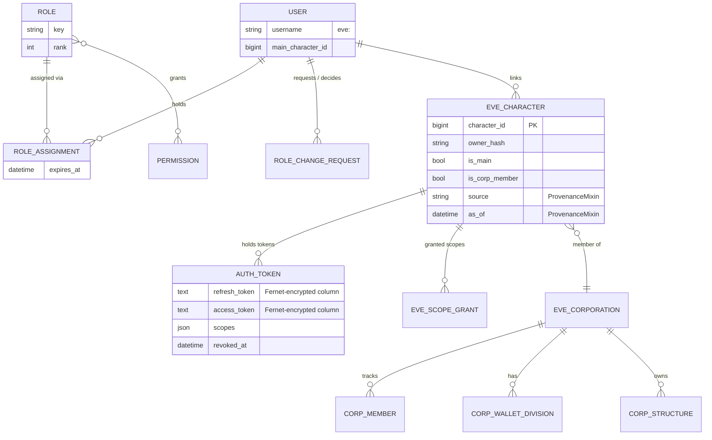

# Domain Model

## Table of contents

- [Overview](#overview)
- [Identity and access (RBAC)](#identity-and-access-rbac)
- [EVE SSO integration](#eve-sso-integration)
- [The SDE reference layer](#the-sde-reference-layer)
- [ProvenanceMixin: honest data freshness](#provenancemixin-honest-data-freshness)
- [Core identity / SSO / corporation ER diagram](#core-identity--sso--corporation-er-diagram)
- [Bounded contexts (one line per app)](#bounded-contexts-one-line-per-app)

## Overview

Each Django app under `apps/` is a bounded context with its own `models.py` (or, for
larger apps, a `models.py` plus supporting service/engine/dimension modules). Shared
model primitives live in `core/mixins.py`. This page summarises the identity/SSO
core in depth, since almost every other app's models reference it, and gives a
one-line responsibility for every app so you can find the right bounded context
quickly.

## Identity and access (RBAC)

`apps.identity.models` (module docstring: *"Identity & Access: users, roles,
permissions, role assignments"*) defines the platform's own account and RBAC layer:

- **`User`** (`AUTH_USER_MODEL = "identity.User"`) — extends Django's
  `AbstractUser`. There is no EVE password stored anywhere; the username is an opaque
  `eve:<character_id>`-style string, and identity is established entirely through
  linked `EveCharacter` rows. `max_role_rank()` and `active_permission_keys()` compute
  (and memoize on the instance) the user's highest role tier and any explicit lateral
  capability grants — consumed by `core.rbac`.
- **`Permission`** — a named capability key (e.g. `recruitment.manage`).
- **`Role`** — a named tier (`key`, `rank`) with a many-to-many to `Permission`.
- **`RoleAssignment`** — the join between a `User` and a `Role`, with an optional
  `expires_at` and a record of who granted it (`granted_by`).
- **`RoleChangeRequest`** — implements dual control for granting the `director` role
  (see `core.rbac.requires_dual_control`): a director requests a grant, a *different*
  director must approve it before it takes effect. A partial unique constraint allows
  at most one open (`pending`) request per `(target, role_key)` pair.

`core.rbac` layers ordered role tiers (`public` → `member` → `officer` → `director` →
`admin`, via `ROLE_RANK`) on top of this, plus a small set of **lateral capabilities**
(`recruiter`, `fc`) that grant one specific permission (`recruitment.manage`,
`fleet.manage`) without full officer rank. See
[permissions-and-roles.md](../permissions-and-roles.md) for the complete reference.

## EVE SSO integration

`apps.sso.models` (*"EVE SSO Integration: linked characters, encrypted tokens, scope
grants"*) is the bridge between a platform `User` and their EVE Online character(s):

- **`EveCharacter`** — one row per linked EVE character (`ProvenanceMixin`). Carries
  the EVE SSO `owner_hash` (detects a character transferred to a different EVE
  account, so a post-transfer login can be refused rather than silently inheriting the
  previous owner's account/roles/data), corporation/alliance affiliation, `is_main`,
  `is_corp_member`, and staleness timestamps (`affiliation_updated_at`,
  `director_checked_at`) that drive the capped, staleness-ordered reconcile tasks.
- **`AuthToken`** — OAuth tokens for a character's granted scopes. The refresh token
  and access token are stored as `_refresh_token`/`_access_token` database columns and
  exposed only through `refresh_token`/`access_token` **properties** that
  transparently encrypt/decrypt via `core.esi.tokens` (Fernet) — the ciphertext column
  is never read or written directly by calling code. Multiple tokens per character are
  allowed (multi-director resilience for corp-wide syncs).
- **`EveScopeGrant`** — which ESI scope a character has granted and which opt-in
  feature it unlocks (`EVE_SSO_FEATURE_SCOPES` in `config/settings/base.py`).

## The SDE reference layer

`apps.sde.models` (*"Static Data Export (SDE) reference models"*) mirrors CCP's
published Static Data Export as plain read-mostly reference tables: `SdeCategory`,
`SdeGroup`, `SdeType`, `SdeRegion`, `SdeConstellation`, `SdeSolarSystem`,
`SdeSystemJump`, `SdeStation`, `SdeCelestial`, plus blueprint/invention/skill
requirement tables (`SdeBlueprintMaterial`, `SdeTypeMaterial`, `SdeBlueprintSkill`,
`SdeTypeSkill`, `SdeInventionProduct`, `SdeDecryptor`, `SdeBlueprintActivityTime`).
This layer is loaded by management commands (`load_sde` for the bundled sample,
`import_sde_fuzzwork` for the full Fuzzwork-mirrored export) rather than synced from
ESI, and every other app that needs a ship/module/system name, blueprint material
list, or security status joins against it instead of duplicating EVE's static data.

## ProvenanceMixin: honest data freshness

`core.mixins.ProvenanceMixin` (`source`, `as_of`, `fetched_at`) is an abstract base
every ESI-derived model includes. `source` is one of `Source.ESI_CHAR`,
`Source.ESI_CORP`, `Source.MANUAL`, `Source.ZKILL`, `Source.EVEREF`, `Source.SDE`,
`Source.ESTIMATED`, or `Source.SYSTEM`. Combined with `core/freshness.py`'s
per-data-class staleness thresholds (`THRESHOLDS`, e.g. 10 minutes for killmails, 24
hours for market history) and `humanize_as_of()`, this is what lets a page show an
honest "as of 12m ago" label instead of presenting synced data as live. `EveCharacter`,
`Killmail`, `EveAlliance`, `PartnerAlliance`, `FriendlyCorporation`, `CorpMember`,
`EveCorporation`, `CorpWalletDivision`, `Contact`, `CorpStructure`, and
`CombatMetric` are examples of models built on this mixin.

## Core identity / SSO / corporation ER diagram

## Bounded contexts (one line per app)

Derived from each app's `models.py` module docstring and `handbooks/feature-catalog.md`:

| App | Responsibility |
|---|---|
| `identity` | User accounts, roles, permissions, role assignments, dual-control role requests. |
| `sso` | EVE SSO login, linked characters, encrypted OAuth tokens, ESI scope grants. |
| `characters` | Per-character skill / skill-queue / attribute snapshots. |
| `corporation` | Corporation/alliance profiles, member roster, wallets, contacts, structures. |
| `sde` | Static Data Export reference tables (types, systems, blueprints, skills). |
| `killboard` | Killmails, participants, items, battle reports, watchlists, combat ranks. |
| `doctrines` | Doctrine library: fits, ship/skill requirements, XML import. |
| `skills` | Ordered skill-training plans toward doctrine goals. |
| `industry` | Industry projects, items, bills of materials, blueprints, PI plans. |
| `planetary` | Planetary Industry guide, planner, and colony import. |
| `market` | Market locations, prices, order snapshots, trade signals. |
| `stockpile` | Corp/personal stockpiles, reservations, hauling, contracts. |
| `mining` | Mining ledger, participation tracking, tax, profit-split payouts. |
| `erp` | Lightweight industrial ERP: production jobs and material consumption. |
| `onboarding` | New-player onboarding: milestones, progress checklist, glossary. |
| `recommendations` | Explainable suggestions and the officer action queue. |
| `admin_audit` | Append-only audit log, app settings, data-retention policy. |
| `pilots` | Pilot engagement spine: personal preferences and the contribution ledger. |
| `tasks` | The corporation task board (execution backbone). |
| `srp` | Ship Replacement Program: settings, rules, claims, budget. |
| `readiness` | Corporation readiness snapshots, findings, and recommendations. |
| `operations` | Fleet operations and war planner: scheduling, RSVP, PAP. |
| `kb` | Knowledge base: versioned corp documentation with live embeds. |
| `recruitment` | Recruitment candidate tracker and evidence desk. |
| `logistics` | Freight (courier) service: rate card and contract reconciliation. |
| `buyback` | Buyback & appraisal service: config plus member-posted offers. |
| `store` | Corp Store: built-to-suit ship ordering. |
| `navigation` | Ansiblex jump-bridge registry, route/jump planners, region maps. |
| `command_intel` | Command Intelligence: LLM-backed reports, COAs, campaigns, battle AARs. |
| `mentorship` | Mentorship Program: pairing, learning tracks, field exercises. |
| `pingboard` | Unified alerting + calendar: channels, rules, scheduled dispatch. |
| `raffle` | Engagement raffle contests: tickets, commit-reveal draws, ledger. |
| `comms_access` | External comms (Discord, etc.) role sync from membership + RBAC. |

See [feature-catalog.md](../feature-catalog.md) for the member-facing feature
descriptions these apps power, grouped by area.
