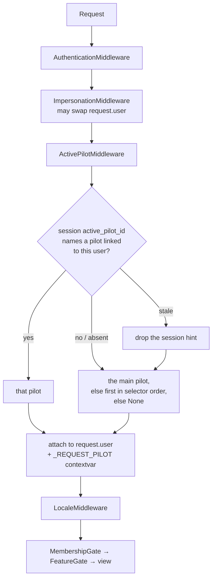

# Linked Pilots and the active-pilot context

One human account (`identity.User`) may hold several EVE pilots (`sso.EveCharacter`), each
authorised independently through EVE SSO. The user selects which pilot they are **acting as**,
and everything pilot-specific follows that selection.

Nothing is merged. Selecting a pilot changes *which* pilot the app acts as; it never widens the
app's view to the union of an account's pilots.

Design decisions are numbered `LP-n` and referenced from the code.

## The three concepts

| Concept | Type | Notes |
| --- | --- | --- |
| **Application user** | `identity.User` | The human. Owns the session and the language preference. |
| **Pilot** | `sso.EveCharacter` | An EVE character with its own tokens, corp, roles, skills, data. |
| **Active pilot** | session + `core.pilots` | Which pilot the human is currently being. |

There is **no** `user_pilots` join table. `EveCharacter.user` (a nullable FK) already models the
link, and it enforces the security rule in the schema: a pilot belongs to **at most one**
account. A join table would permit many-to-many, and we would then have to add a constraint
forbidding exactly what the table exists to allow (LP-1).

## Resolving the active pilot



The session value is a **hint, never an authorisation**. `core.pilots.resolve_active_pilot`
re-checks on *every* request that the pilot is still linked to the signed-in user, so a pilot
unlinked in another tab — or detached by an officer — collapses to a safe default on the very
next request instead of lingering for the life of the session.

## Writing pilot-aware code

**Use `core.pilots.acting_pilot(user)`.** It is the one right answer everywhere:

* in a request → the **active** pilot (ownership-checked by the middleware);
* outside a request (Celery, a management command) → the account's **main**, because a
  background job has no session to have selected anything.

```python
from core import pilots

def my_view(request):
    pilot = pilots.acting_pilot(request.user)   # ✅
```

Do **not** write any of these. They all mean "the account's main", which is only the same thing
by accident, and only while a user has one pilot:

```python
user.main_character                                            # ❌ (see below)
user.characters.filter(is_main=True).first()                   # ❌
next((c for c in user.characters.all() if c.is_main), None)    # ❌
```

`User.main_character` still exists and must **not** be repointed: it is dual-purpose, and also
resolves *other people's* display names in leaderboards, recognition feeds and the members
console, where "the pilot that user is currently flying" is neither knowable nor wanted.

### Templates

`main_character` in a template context is the **active** pilot (`core/context.py`). The name is
kept because ~30 templates already use it, and every one of them always meant the active pilot.
`active_pilot` is the honest name for new code; `linked_pilots` is the selector's roster.

## Authority: the ceiling (LP-4)

Role grants say what the **human** is trusted with. The pilot they are flying decides what may
be **exercised**. Effective authority is the lesser of the two — the `sudo` model.

```
effective_rank(user) = min( account_rank, authority_ceiling(active_pilot) )
```

| Active pilot | Ceiling |
| --- | --- |
| not in the home corporation | `public` |
| in the corp, not an in-game Director | `officer` |
| in the corp, an in-game Director | `admin` (no practical ceiling) |
| the account holds no pilots at all | no ceiling — there is nothing to inherit *from* |
| no pilot resolved (Celery) | no ceiling — the account-wide question is the right one |

**`is_superuser` and the `ROLE_ADMIN` grant are exempt.** They are the platform operator, not a
corp rank; ceilinging them would let an admin lock themselves out by switching to an alt, and
the ranks are a ladder, so any cap low enough to withdraw Director (30) also withdraws Admin (40).

Everything funnels through `core.rbac.effective_rank`, so `has_role`, `has_perm`, `role_required`,
`perm_required`, the DRF permission classes, `MembershipGateMiddleware`, `FeatureGateMiddleware`,
`feature_visible_to` and the `roles` context processor all became pilot-aware at **one seam**.

Per-pilot Director status lives on `EveCharacter.is_corp_director`, written by the same ESI
reconcile that grants the account role.

> **Officer authority follows the human across their corp pilots.** Officer is a trust grant to a
> *person*, and unlike Director there is no per-character evidence that could narrow it. Recorded
> as a deliberate consequence, and tested.

## Linking (LP-5)

One registered callback serves both login and linking — EVE validates `redirect_uri` against the
CCP developer application, so a second callback URL would force every operator to reconfigure
their app. The **intent is therefore bound to the OAuth state, server-side**:

| Session key | Meaning |
| --- | --- |
| `eve_sso_flow` | `"login"` or `"link"` — written next to the state, read in the callback |
| `eve_sso_link_user` | the account that *started* a link flow, re-checked on the way back |
| `eve_sso_state`, `eve_sso_verifier` | state + PKCE, single-use |
| `eve_sso_next` | where to land, validated in and out |

Without `eve_sso_link_user`, a link begun by one account and completed after the session became
another would attach the newly authorised pilot to the wrong account.

`POST /auth/eve/link/` — never GET. A GET that begins an OAuth authorisation is login-CSRF: any
page on the internet could start the flow in a victim's session from an `` tag.

**Reauthorising is the same flow.** CCP's screen is where the human picks the character, so we
cannot preselect one; `character_id` is only a statement of intent, and the callback says so
plainly when a different pilot comes back.

## Data isolation (LP-3, LP-14)

Two quest logs were genuinely merged **in the database** — computed from one character, stored
against the account:

* `command_intel.PilotDirective` — now keyed `(user, character, slug)`.
* `readiness.PilotRecommendation` — now keyed `(user, character_id, category, ref_type, ref_id)`.

Every pilot-specific cache key names the **character**, never the account. `briefing:pilot:v3:*`
was `briefing:pilot:v2:{user.pk}` and is now keyed by character **and** by language
(`core.i18n.i18n_cache_key`) — it caches gettext prose and is warmed by a Celery worker with no
language activated.

The htmx localStorage history cache is disabled (`historyCacheSize = 0`): it is a disk cache of
rendered, pilot-specific HTML that no `Cache-Control` header governs, and a Back press after a
switch could repaint the previous pilot's page.

## Language (LP-8)

**Untouched.** Language is resolved from the human (`User.language` → the `forca_language`
cookie → `Accept-Language` → the corp default) and never from a character. Switching pilots
cannot change it. There is no language state in the session at all — Django ≥ 4.0 removed it.

## Terminology (LP-12)

The user-facing word is **pilot**. The main/default pilot is the **main**, never the "primary" —
`primary` is a protected EVE term (the FC's called kill target) that every locale must keep in
English, so "Primary Pilot" would render untranslated everywhere. See
`core/i18n/data/protected-terms.yml`.

## Adding a new pilot-specific surface — the checklist

1. Resolve the pilot with `pilots.acting_pilot(user)`. Never `is_main`.
2. If you cache it, put the **character id** in the key. If it holds translated prose, wrap the
   key in `core.i18n.i18n_cache_key`.
3. If you persist it, put the **character** in the row's identity, not just the user.
4. If it is authority-sensitive, you get the ceiling for free via `core.rbac` — do not
   re-implement a role check against `user.characters`.
5. Add a test that a second pilot on the same account sees *their own* data.
