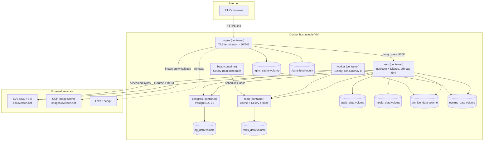

# Operator Handbook

[FORCA] Command Grid is a Django + Celery + PostgreSQL + Redis + nginx application,
distributed as a **fully containerized** Docker Compose stack. This handbook is written
for the person who runs that stack in production: provisioning the host, deploying and
upgrading the application, keeping it configured, backing it up, and responding when
something breaks.

## Table of contents

- [Audience](#audience)
- [Deployment architecture](#deployment-architecture)
- [What's in the stack](#whats-in-the-stack)
- [Data volumes](#data-volumes)
- [Operator pages](#operator-pages)
- [Where to look next](#where-to-look-next)

## Audience

This handbook is for **operators** — the person or team responsible for the server(s)
running a [FORCA] Command Grid instance. It assumes comfort with Linux, Docker Compose,
and the command line, but not with the Django/Celery internals. If you are looking for:

- **How a specific environment variable behaves** — see the
  [Configuration Reference](../configuration-reference.md) (canonical, exhaustive).
- **What data the application stores and how it protects it** — see
  [Data and Privacy](../data-and-privacy.md).
- **Who can do what inside the app** — see
  [Permissions and Roles](../permissions-and-roles.md).
- **What each scheduled background job does** — see
  [Background Jobs Reference](../reference/background-jobs.md).
- **How to set up an outbound integration (Discord, LLM, etc.)** — see
  [Third-Party Services](../third-party-services.md).

This handbook links to those pages rather than repeating them.

## Deployment architecture

The entire stack — including the reverse proxy — runs in Docker Compose. There is **no
host nginx** and no other host-level runtime dependency beyond Docker itself.
[`docker-compose.prod.yml`](../../docker-compose.prod.yml) is the source of truth.

Key architectural facts, all drawn directly from the compose files:

- **nginx** is the only container with a host port mapping (`80:80`, `443:443`). It
  terminates TLS, reads its certificate from a `./certs` bind mount, rate-limits the
  login surface and the general app surface separately, proxies/caches EVE type images,
  and drops requests whose `Host` header is a bare IP with a `444` response.
- **web** runs gunicorn with the `gthread` worker class (5 workers × 4 threads) and is
  the only service nginx talks to.
- **worker** and **beat** are separate containers running the same application image
  with different Celery commands — no web traffic reaches them directly.
- **postgres** and **redis** have **no host port mapping at all** — they are reachable
  only from other containers on the compose network.
- Every application container (`web`/`worker`/`beat`) runs as the **non-root** `appuser`
  with `cap_drop: ALL` and `no-new-privileges:true`.
- Each service carries a `mem_limit` sized to its observed working set (see
  [Requirements](./requirements.md) for the sizing rationale).

## What's in the stack

| Component | Image / runtime | Role |
|---|---|---|
| `nginx` | `nginx:1.27-alpine` | TLS termination, reverse proxy, EVE image cache, rate limiting, crawler control |
| `web` | Built from [`Dockerfile`](../../Dockerfile) (Python 3.12-slim) | Django application served by gunicorn |
| `worker` | Same image, `celery worker` | Runs all ESI syncs, imports, and background computation |
| `beat` | Same image, `celery beat` | Schedules ~90 recurring tasks (see [background jobs](../reference/background-jobs.md)) |
| `postgres` | `postgres:16-alpine` | Primary datastore, tuned for the reference host |
| `redis` | `redis:7-alpine` | Django cache backend + Celery broker, password-protected, bounded `maxmemory` |

## Data volumes

| Volume | Contents | Notes |
|---|---|---|
| `pg_data` | PostgreSQL data directory | The database of record — back it up (see [Backup and Restore](./backup-and-restore.md)) |
| `redis_data` | Redis RDB persistence | Cache + broker; disposable, but persisted across restarts |
| `static_data` | Collected static assets | Populated by `collectstatic` |
| `media_data` | User/application-uploaded media | |
| `archive_data` | Archived application data | Written by `web` and `worker` |
| `eveimg_data` | Mirrored EVE type icons/renders | Written by `mirror_type_images`, served read-only by nginx |
| `nginx_cache` | nginx's EVE-image proxy cache | Survives nginx restarts so images aren't re-fetched from CCP |
| `./certs` (bind mount) | TLS certificate and key | Managed by `scripts/cert-init.sh` / certbot renewal hooks |

## Operator pages

| Page | Covers |
|---|---|
| [Requirements](./requirements.md) | Host OS, hardware sizing, external services, EVE application registration |
| [Deployment](./deployment.md) | Fresh install, the one-shot script, the Makefile lifecycle, data bootstrap |
| [Run your corp's killboard](./killboard-self-host.md) | Killboard-first quick start: the ESI app, the `killboard` profile, the setup wizard, history import, branding |
| [Configuration](./configuration.md) | Operator's walkthrough of required and optional settings |
| [Operations Runbook](./operations-runbook.md) | Daily/weekly/monthly checklists |
| [Monitoring and Health](./monitoring-and-health.md) | `/healthz`, `scripts/healthcheck.sh`, the `/ops/health/` page, logs, alerting |
| [Backup and Restore](./backup-and-restore.md) | `scripts/backup.sh`, `scripts/restore.sh`, nightly cron, disaster recovery |
| [Upgrades](./upgrades.md) | `scripts/update.sh` / `make update`, migrations, rollback |
| [Troubleshooting](./troubleshooting.md) | Symptom → cause → action reference |
| [Security Hardening](./security-hardening.md) | The checklist of controls this deployment implements |

## Where to look next

New to this deployment? Start at [Requirements](./requirements.md), then
[Deployment](./deployment.md). Already running? Bookmark the
[Operations Runbook](./operations-runbook.md) and
[Troubleshooting](./troubleshooting.md).
