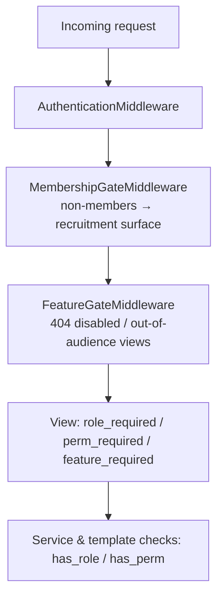

# Permissions and Roles

This page documents how [FORCA] Command Grid decides who can see and do what: the role
tiers, the least-privilege lateral capabilities, feature gating and audiences, the
membership gate, and the ESI scopes the application requests. It is grounded in the
implementation in [`core/rbac.py`](../core/rbac.py), [`core/features.py`](../core/features.py),
[`core/middleware.py`](../core/middleware.py), and the settings in
[`config/settings/base.py`](../config/settings/base.py).

## Table of contents

- [Role tiers](#role-tiers)
- [Lateral capabilities (least privilege)](#lateral-capabilities-least-privilege)
- [Dual control for Director](#dual-control-for-director)
- [How permissions are checked](#how-permissions-are-checked)
- [The membership gate](#the-membership-gate)
- [Feature flags and audiences](#feature-flags-and-audiences)
- [ESI scopes](#esi-scopes)
- [Assigning access (for administrators)](#assigning-access-for-administrators)
- [Troubleshooting access problems](#troubleshooting-access-problems)

## Role tiers

Access is built on ordered role tiers. A higher tier includes the authority of every
lower tier.

| Role | Rank | Who it is | Typical scope |
|---|---:|---|---|
| `public` | 0 | Anonymous visitors and logged-in non-members | Public killboard, recruitment/onboarding surface, public knowledge-base pages, and audience-`public` features |
| `member` | 10 | Pilots whose character is in the home corporation | All member tools: dashboard, doctrines, industry, readiness, SRP, personal data |
| `officer` | 20 | Line leadership | Officer boards: recommendations, readiness dashboard, operations management, kill-feed settings, most console pages |
| `director` | 30 | Senior leadership | Everything officer, plus director-only console sections, sensitive relays, and highest classification tiers |
| `admin` | 40 | Superuser accounts | Full access; bypasses gates. Reserved for break-glass operations |

A pilot who holds the in-game **Director** corporation role is automatically granted the
application's Director role at login and on a periodic reconcile (see
[ESI integration](./contributor-handbook/esi-integration.md)). Superusers always resolve
to `admin` rank.

## Lateral capabilities (least privilege)

Two lateral roles grant a **specific capability without full officer rank**, so a member
can be trusted with one workflow and nothing else:

| Capability key | Lateral role | Grants |
|---|---|---|
| `recruitment.manage` | `recruiter` | Work the recruitment candidate pipeline |
| `fleet.manage` | `fc` | Run fleet operations |

Each capability is **also implied** by a rank baseline (officer and above), so every
surface that was rank-gated still works for officers and directors; the lateral role
simply extends that one capability down to a specific member. An unknown capability key
fails closed to a Director baseline, so a typo never accidentally grants access.

## Dual control for Director

Granting the **Director** role requires a **second director's approval** (dual control):
a single, possibly compromised, director account cannot unilaterally mint another
director. Revocations still apply immediately, protected elsewhere by a
"last director" floor that prevents locking the corporation out of its own directorate.

## How permissions are checked

Permissions are enforced in several complementary layers (defence in depth):

- **`role_required(role)`** — a view decorator enforcing a minimum tier.
- **`perm_required(perm_key)`** — a view decorator enforcing a lateral capability (rank
  baseline **or** an explicit, non-expired grant).
- **`has_role(user, role)` / `has_perm(user, perm_key)`** — the underlying checks, also
  used in templates and services.
- **DRF permission classes** — `IsMember`, `IsOfficer`, `IsDirector`, `IsAdmin` for API
  endpoints.
- **`feature_required(key)`** and **`FeatureGateMiddleware`** — 404 a view when its
  feature is disabled or the user is outside its audience.
- **`MembershipGateMiddleware`** — confines logged-in non-members to the recruitment
  surface.

## The membership gate

`MembershipGateMiddleware` centrally restricts an authenticated pilot who is **not** in
the home corporation (holds no `member` role) to the recruitment/onboarding surface only.
This ensures no internal page — dashboard, killboard analytics, doctrines, industry,
readiness, briefings — can leak to a prospective recruit. Anonymous visitors are
unaffected (public pages keep their own access), and superusers bypass the gate.

Allowed prefixes for a logged-in non-member include the onboarding surface, EVE SSO
auth pages, the pilot's own privacy/data-rights pages, the recruitment candidate OAuth
flow, and the audience-controlled public surfaces (freight calculator, buyback, store,
doctrines, navigation tools, public knowledge base) whose own views enforce their
audience.

## Feature flags and audiences

Every member-facing feature is **enabled by default**. Leadership turns features off, or
sets an audience, at **Admin Console → Services & features** (`/ops/admin/features/`).

**Plain on/off features** are simply visible or hidden. **Audience-controlled features**
choose *who* can see them, using a 4-state audience:

| Audience | Who can see it |
|---|---|
| `disabled` | Nobody |
| `corp` | Home-corporation members |
| `alliance` | Members plus registered partner-alliance and friendly-corporation pilots |
| `public` | Everyone, including anonymous visitors |

Audience-controlled features include **doctrines** (default `corp`), **navigation & maps**
(default `public`), and **raffles** (default `corp`). The member services (freight,
buyback, corp store) carry their own equivalent audience configuration on their own
settings pages.

The gate is enforced both in the navigation (disabled features are hidden) and in
`FeatureGateMiddleware` (a direct URL to a disabled or out-of-audience view returns 404).

## ESI scopes

EVE SSO scopes fall into two groups: a **baseline set requested at login**, and
**opt-in feature scopes** a pilot or director grants later from the ESI Scopes page
(`/auth/eve/scopes/`). The scope strings are defined in
`settings.EVE_SSO_DEFAULT_SCOPES` and `settings.EVE_SSO_FEATURE_SCOPES`; the user-facing
catalogue lives in [`apps/sso/scopes.py`](../apps/sso/scopes.py).

### Baseline login scopes

Requested from every member at login. These deliver the app's core value without extra
tuning:

| Scope | Enables |
|---|---|
| `publicData` | Basic character/token identity |
| `esi-skills.read_skills.v1` | Skills for readiness and plans |
| `esi-skills.read_skillqueue.v1` | Skill queue for readiness and idle-queue nudges |
| `esi-killmails.read_killmails.v1` | The pilot's own killmails (personal losses) |
| `esi-clones.read_implants.v1` | Implants for training estimates |
| `esi-killmails.read_corporation_killmails.v1` | Corp killmails (used with an in-game Director token) |
| `esi-corporations.read_corporation_membership.v1` | Corp membership |
| `esi-characters.read_corporation_roles.v1` | The character's in-game corp roles (auto-grants the app Director role to in-game Directors) |

### Opt-in feature scopes

Granted per feature from the ESI Scopes page. **PILOT** scopes read the pilot's own data;
**DIRECTOR** scopes require the named in-game corporation role.

| Feature key | Audience | In-game role | Scope(s) | Purpose |
|---|---|---|---|---|
| `personal_assets` | Pilot | — | `esi-assets.read_assets.v1`, `esi-universe.read_structures.v1` | Show your own assets |
| `my_industry` | Pilot | — | `esi-industry.read_character_jobs.v1`, `esi-characters.read_blueprints.v1` | Track your industry jobs and blueprints |
| `freight_search` | Pilot | — | `esi-search.search_structures.v1`, `esi-universe.read_structures.v1` | Structure search for freight pickup/drop-off |
| `my_contracts` | Pilot | — | `esi-contracts.read_character_contracts.v1` | Verify your own hauls |
| `corp_contracts` | Director | Director | `esi-contracts.read_corporation_contracts.v1` | Auto-verify all haulers' courier deliveries |
| `corp_assets` | Director | Director | `esi-assets.read_corporation_assets.v1`, `esi-universe.read_structures.v1` | Corp stockpile and supply |
| `corp_roster` | Director | Director | `esi-corporations.read_corporation_membership.v1`, `esi-corporations.track_members.v1` | Roster with location/ship/last login |
| `corp_finance` | Director | Accountant or Director | `esi-wallet.read_corporation_wallets.v1` | Wallet balances and journal |
| `corp_contacts` | Director | Director | `esi-corporations.read_contacts.v1` | Standings board |
| `jump_network` | Director | Director or Station Manager | `esi-corporations.read_structures.v1`, `esi-universe.read_structures.v1` | Ansiblex + cyno network for the jump planner |
| `corp_structures` | Director | Director or Station Manager | `esi-corporations.read_structures.v1`, `esi-universe.read_structures.v1` | Structure fuel/state/timers |
| `moon_mining` | Director | Station Manager or Director | `esi-industry.read_corporation_mining.v1` | Moon extraction calendar |
| `corp_industry` | Director | Director or Factory Manager | `esi-corporations.read_blueprints.v1`, `esi-industry.read_corporation_jobs.v1` | Corp blueprints and jobs |
| `notifications` | Director | Director or role-holder | `esi-characters.read_notifications.v1` | Relay in-game notifications |
| `mail_relay` | Pilot | — | `esi-mail.read_mail.v1` | Relay mailing-list mail to Discord |
| `readiness_mail` | Director | — | `esi-mail.send_mail.v1` | Send readiness alert EVE-mail |
| `pingboard_mail` | Director | — | `esi-mail.send_mail.v1` | Send Pingboard alert EVE-mail |
| `fleet_tracking` | Pilot | — | `esi-fleets.read_fleet.v1` | Auto-record fleet attendance (PAP) |
| `corp_contracts` (oversight) | Director | Director | `esi-contracts.read_corporation_contracts.v1` | Corp contract oversight board |
| `mentorship_presence` | Pilot | — | `esi-location.read_location.v1`, `esi-location.read_online.v1` | Confirm presence during a mentoring session |
| `fittings` | Director | Director | `esi-fittings.read_fittings.v1` | Import saved fits as doctrines |
| `planetary_industry` | Pilot | — | `esi-planets.manage_planets.v1` | Import PI colonies into the planner |

The recruitment (second) SSO application requests only `publicData`,
`esi-skills.read_skills.v1`, and `esi-characters.read_corporation_roles.v1`, and never
stores the token.

## Assigning access (for administrators)

- **Member access** is automatic: when a pilot links a character that is in the home
  corporation, they gain the `member` role. When they leave the corporation, member
  access is removed on the next sync.
- **Director** is auto-granted to pilots holding the in-game Director role. Application
  role grants that require it use dual control.
- **Officer** and the **lateral capabilities** (`recruiter`, `fc`) are assigned through
  the Admin Console access-governance section.
- **Feature availability and audiences** are set at Admin Console → Services & features.
- **Directors grant corp-wide ESI scopes** (roster, assets, wallet, structures, and so
  on) from the ESI Scopes page using a character that holds the required in-game role.

## Troubleshooting access problems

| Symptom | Likely cause | Action |
|---|---|---|
| A member sees "not enabled" / 404 on a feature | The feature is disabled or its audience excludes them | Check Admin Console → Services & features |
| A logged-in pilot is bounced to onboarding | They are not in the home corporation (no `member` role) | Confirm the character's corp membership; re-sync roster |
| A new in-game Director lacks Director access | Role reconcile has not run yet | Wait for the scheduled reconcile or have them re-authorise; verify the corp-roles scope |
| Corp data (assets, wallet, structures) is empty | No director has granted the required corp scope | Have a director with the in-game role grant the scope on the ESI Scopes page |
| Granting Director "does nothing" | Awaiting a second director's approval (dual control) | Have a second director approve the grant |
| Officer cannot send urgent/emergency pings | The Pingboard dispatch floor is director-only | Adjust the floor in Admin Console → Pingboard, or have a director send it |
