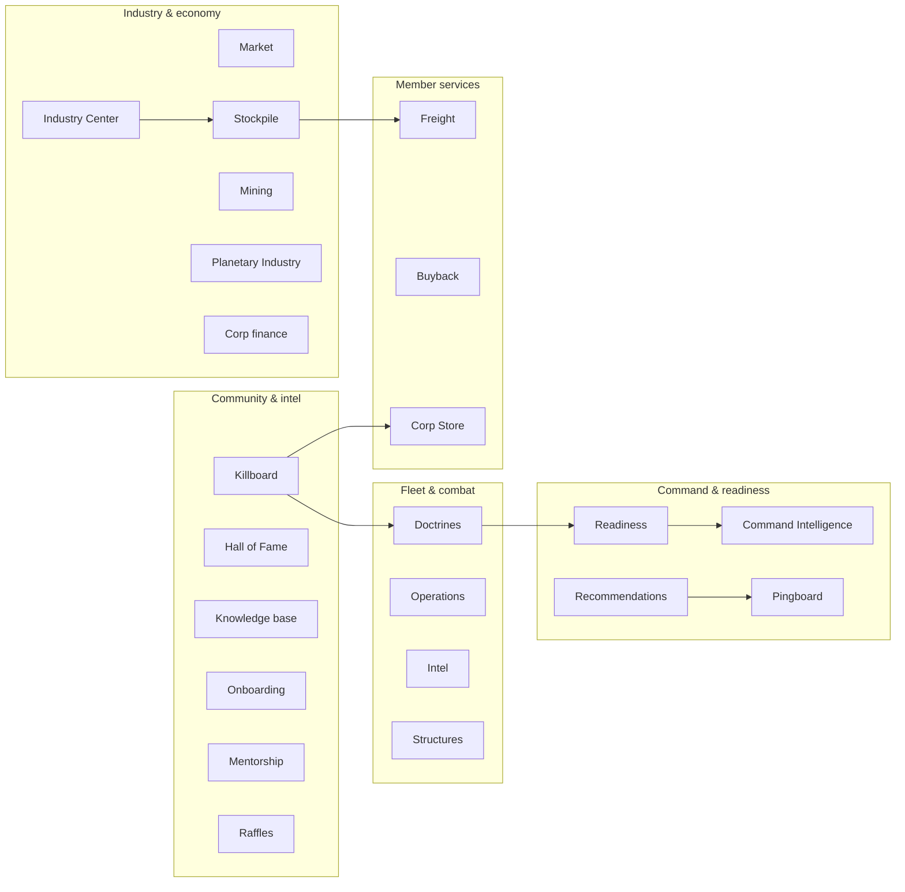
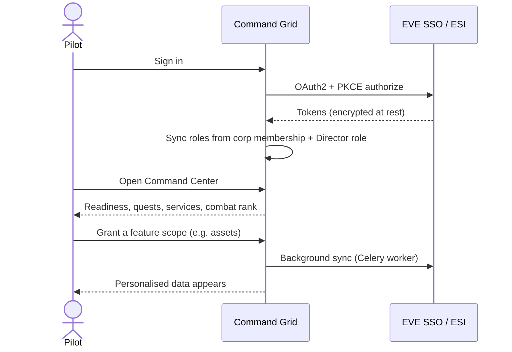
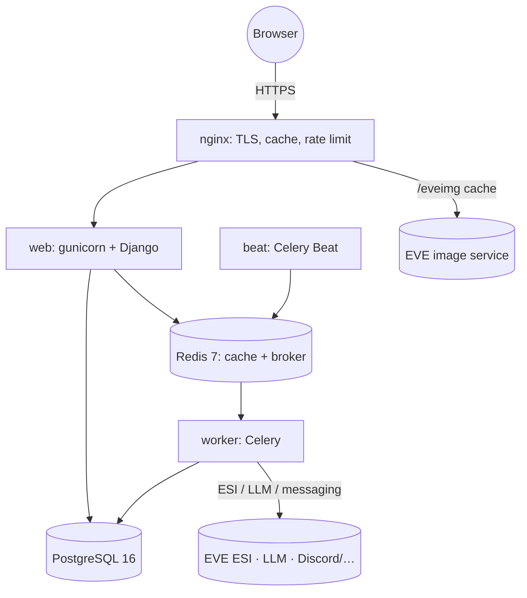

# Product Overview

## Table of contents

- [What FORCA Command Grid is](#what-forca-command-grid-is)
- [The problems it solves](#the-problems-it-solves)
- [Value by role](#value-by-role)
- [High-level modules](#high-level-modules)
- [EVE Online, ESI, and pilot identity](#eve-online-esi-and-pilot-identity)
- [High-level user journeys](#high-level-user-journeys)
- [Architecture overview](#architecture-overview)

## What FORCA Command Grid is

[FORCA] Command Grid is a free, self-hostable **operations hub for an EVE Online
corporation**. It connects a corporation's combat record, doctrines, member skills,
industry, market activity, logistics, and new-player onboarding into one application, and
ends every screen with a clear answer to *"what should I — or we — do next?"* for a
specific role.

It is not just a killboard. The killboard is one module among many; the value comes from
the way the modules feed each other — losses inform doctrine supply, doctrines inform skill
plans, skills inform fleet readiness, readiness informs leadership decisions, and every
contribution is recognised.

## The problems it solves

Running an EVE corporation well means constantly turning raw game data into decisions:

| Problem | How Command Grid helps |
|---|---|
| "Who can fly our doctrines, and who is close?" | Doctrine library + per-pilot readiness engine |
| "What did we lose, and what should we restock?" | Killboard valuation → doctrine supply plans |
| "Are we ready for the next op?" | Readiness platform scoring across weighted dimensions |
| "What should this pilot train next?" | Skill plans toward doctrine goals |
| "Where are our stockpiles short, and who can haul?" | Stockpile targets + a member hauling board |
| "Is our corp financially and materially healthy?" | Finance, structures, and infrastructure dashboards |
| "How do we welcome and grow new pilots?" | Onboarding checklists and a mentorship programme |
| "How do we recognise the people doing the work?" | Contribution ledger, Hall of Fame, combat ranks, raffles |
| "How do we reach members off-site reliably?" | Pingboard alerting to Discord/Slack/Telegram/WhatsApp/EVE-mail |

## Value by role

Only capabilities that exist in the application are listed here.

- **Line pilots and newbros:** a single Command Center home page, doctrine readiness and
  skill plans, personal combat analytics, onboarding milestones, mentorship, and access to
  member services (freight, buyback, corp store).
- **Fleet commanders:** an operations planner with readiness scoring, ship sign-ups, RSVP,
  automatic attendance (PAP) from the live fleet, and form-up reminders.
- **Recruiters:** an evidence desk that works on public data by default, with an optional
  time-boxed candidate ESI consent.
- **Industrialists and logistics teams:** the Industry Center (BOM, invention, chains,
  jobs), corp stockpile and asset mirrors, a hauling board, a freight service, and market
  intelligence.
- **Directors and leadership:** corp finance, structures, standings, a readiness dashboard
  and weekly report, explainable recommendations, an LLM-backed Command Intelligence
  subsystem, and a full role-gated admin console with an audit log.

## High-level modules

The full, implementation-grounded list of features is in the
[feature catalog](./feature-catalog.md).

## EVE Online, ESI, and pilot identity

Command Grid has no passwords of its own. A pilot signs in with **EVE Single Sign-On**,
and the application reads game data through the **EVE Swagger Interface (ESI)** according
to the scopes the pilot has granted:

- A pilot's **application account** is linked to one or more **EVE characters**.
- **Membership** in the home corporation (read from ESI) grants the `member` role; leaving
  the corporation removes it.
- Holding the in-game **Director** role auto-grants the application's Director role.
- **Baseline scopes** are requested at login; **optional feature scopes** are granted later,
  per feature, from the ESI Scopes page. Corporation-wide data (assets, wallet, structures)
  is read using a director's character that holds the required in-game role.

See [permissions-and-roles.md](./permissions-and-roles.md) and
[data-and-privacy.md](./data-and-privacy.md).

## High-level user journeys

Typical journeys:

- **A newbro** links their character, works the onboarding checklist, is paired with a
  mentor, and sees their first doctrine readiness and combat milestones.
- **A member** checks the Command Center each session for their quest log, files an SRP
  claim after a loss, and signs up for the next operation.
- **A director** reviews the readiness dashboard and weekly report, acts on ranked
  recommendations, and configures features and roles in the admin console.

## Architecture overview

- **web** serves the application (gunicorn + Django, server-rendered templates with htmx
  partials and Alpine behaviour).
- **worker** runs all background work — every ESI, LLM, and messaging call happens here,
  never in a web request.
- **beat** dispatches the scheduled jobs (see
  [reference/background-jobs.md](./reference/background-jobs.md)).
- **PostgreSQL** is the system of record; **Redis** backs the cache and the Celery broker.
- **nginx** terminates TLS, rate-limits, and serves EVE imagery same-origin.

For the deployment and contribution views of the architecture, see the
[operator handbook](./operator-handbook/README.md) and
[contributor handbook](./contributor-handbook/architecture.md).
